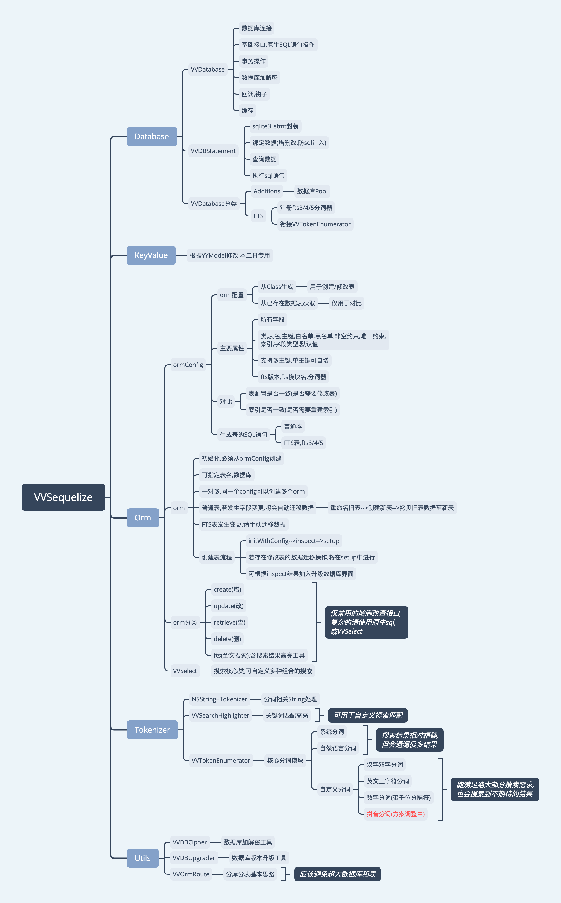

# VVSequelize

[](https://cocoapods.org/pods/VVSequelize)
[](https://cocoapods.org/pods/VVSequelize)
[](https://cocoapods.org/pods/VVSequelize)

## 功能
* [x] 根据Class生成数据表
* [x] 增删改查,insert,update,upsert,delele,drop...
* [x] Where语句生成,可满足大部分常规场景
* [x] 数据库加解密(SQLCipher)
* [x] 原生SQL语句支持
* [x] 常规查询函数支持,max(),min(),sum(),count()...
* [x] 支持主键,可多主键,单主键可自增.
* [x] 支持唯一性约束
* [x] Transaction支持
* [x] Object直接处理
* [x] 数据存储,OC类型支持: NSData, NSURL, NSSelector, NSValue, NSDate, NSArray, NSDictionary, NSSet,...
* [x] 数据存储,C类型支持: char *, struct, union
* [x] 子对象存储为Json字符串
* [x] OrmModel查询缓存
* [x] FTS全文搜索
* [x] 自定义FTS分词器
* [x] 支持拼音分词

## 改动(0.3.0-beta7)
1. 修复一些bug
2. 修改搜索结果高亮匹配
3. VVSelect改为链式语法赋值.

## 结构


## 安装
使用测试版本:
```ruby
    pod 'VVSequelize', :git => 'https://github.com/pozi119/VVSequelize.git'
```
## 注意
1. 子对象会保存成为Json字符串,子对象内的NSData也会保存为16进制字符串.
2. 含有子对象时,请确保不会循环引用,否则`Dictionary/Object`互转会死循环,请将相应的循环引用加入互转黑名单. 
3. VVKeyValue仅用于本工具,不适用常规的Json转对象.

## 用法
此处主要列出一些基本用法,详细用法请阅读代码注释.

### 打开/创建数据库文件
```objc
    self.vvdb = [[VVDatabase alloc] initWithPath:dbPath];
```

### 定义ORM配置
使用`VVOrmConfig`统一表配置,可复用.

普通表配置:
```objc
    VVOrmConfig *config = [VVOrmConfig configWithClass:VVTestMobile.class];
    config.primaries = @[@"mobile"];
```

Fts表配置
```objc
    VVOrmConfig *ftsConfig = [VVOrmConfig configWithClass:VVTestMobile.class];
    ftsConfig.fts = YES;
    ftsConfig.ftsModule = @"fts5";
    ftsConfig.ftsTokenizer = @"jieba pinyin 9";
    ftsConfig.indexes = @[@"mobile", @"industry"];
```
或者
```objc
    VVOrmConfig *ftsConfig = [VVOrmConfig ftsConfigWithClass:VVMessage.class module:@"fts5" tokenizer:@"jieba pinyin" indexes:@[@"info"]];
```
**FTS表配置特别注意**:
* 需设置`ftsConfig.fts=YES`,否则视为普通表.
* fts3以上版本(fts4,fts5)需设置索引字段`ftsConfig.indexes`,否则不会索引任何字段,无法搜索
* ftsTokenizer传入参数`pinyin`,表示该表支持拼音分词,多音字并未智能匹配, 5个汉字以内的中文,可返回多个拼音组合, 超过5个汉字则只返回一组.
* `pinyin`后可带数字参数,比如`jieba pinyin 9`,表示Unicode长度超过9的字符串,不会进行拼音分词

### 定义ORM模型 
可自定义表名和存放的数据库文件.
生成的模型将不在保存在ModelPool中,防止表过多导致内存占用大,需要请自行实现.

示例如下:

```objc
    self.mobileModel = [VVOrm ormWithConfig:config tableName:@"mobiles" dataBase:self.vvdb];
```
### 增删改查
使用ORM模型进行增删改查等操作.

示例如下:

```objc
    NSInteger count = [self.mobileModel count:nil];
    
    BOOL ret = [self.mobileModel increase:nil field:@"times" value:-1];
    
    NSArray *array = [self.mobileModel findAll:nil orderBy:nil limit:10 offset:0];
    
...
```

### 生成SQL子句
现在仅支持非套嵌的字典或字典数组,转换方式如下:
```
//where/having :
{field1:val1,field2:val2} --> field1 = "val1" AND field2 = "val2"
[{field1:val1,field2:val2},{field3:val3}] --> (field1 = "val1" AND field2 = "val2") OR (field3 = "val3")
//group by:
[filed1,field2] --> "field1","field2"
//order by
[filed1,field2] --> "field1","field2" ASC
[filed1,field2].desc --> "field1","field2" DESC
```
示例: 
```objc
- (void)testClause
  {
    VVSelect *select =  [VVSelect new];
    select.table(@"mobiles");
    select.where(@"relative".lt(@(0.3))
                 .and(@"mobile".gte(@(1600000000)))
                 .and(@"times".gte(@(0))));
    NSLog(@"%@", select.sql);
    select.where(@{ @"city": @"西安", @"relative": @(0.3) });
    NSLog(@"%@", select.sql);
    select.where(@[@{ @"city": @"西安", @"relative": @(0.3) }, @{ @"relative": @(0.7) }]);
    NSLog(@"%@", select.sql);
    select.where(@"relative".lt(@(0.3)));
    NSLog(@"%@", select.sql);
    select.where(@"     where relative < 0.3");
    NSLog(@"%@", select.sql);
    select.groupBy(@"city");
    NSLog(@"%@", select.sql);
    select.groupBy(@[@"city", @"carrier"]);
    NSLog(@"%@", select.sql);
    select.groupBy(@" group by city carrier");
    NSLog(@"%@", select.sql);
    select.having(@"relative".lt(@(0.2)));
    NSLog(@"%@", select.sql);
    select.groupBy(nil);
    NSLog(@"%@", select.sql);
    select.orderBy(@[@"city", @"carrier"]);
    NSLog(@"%@", select.sql);
    select.orderBy(@" order by relative");
    NSLog(@"%@", select.sql);
    select.limit(10);
    NSLog(@"%@", select.sql);
    select.distinct(YES);
    NSLog(@"%@", select.sql);
}
```

## Author

Valo Lee, pozi119@163.com

## License

VVSequelize is available under the MIT license. See the LICENSE file for more info.
